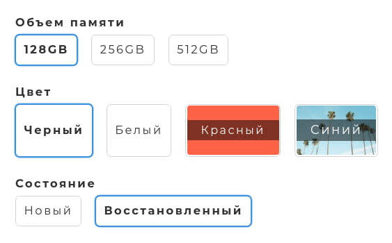
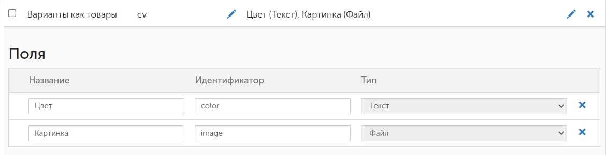
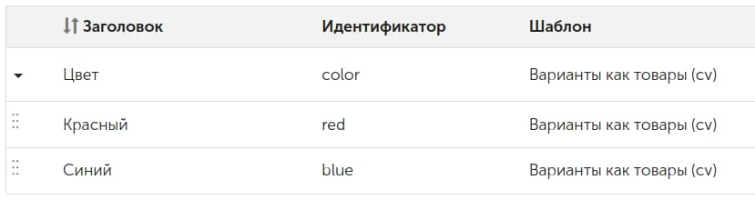
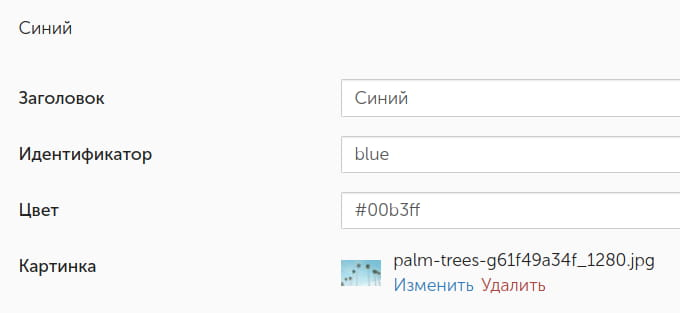

*[← InSales Stuff](https://github.com/kokoccc/insales-code)*

# Liquid – варианты как отдельные товары с разными URL

В InSales у каждого товара могут быть варианты с различными свойствами: размер, цвет и т.п.

Как правило, в большинстве шаблонов выбор варианта происходит динамически на одной странице — посетитель выбирает значение свойства, и информация обновляется на лету. Изменяется фотография; обновляются цена, остаток, артикул.

Но иногда требуется, чтобы каждый вариант располагался на отдельной странице со своим URL-адресом.  
Обычно это нужно для SEO.

Данный модуль помогает реализовать такое поведение при помощи параметров товаров и их комбинаций.

Мы можем связывать товары и значения их параметров через:
  - категории по пермалинкам
  - канонические категории
  - сопутствующие товары
  - аналогичные товары

Также, как видно на скриншоте, можно задавать для определенных значений картинки и цвета (поскольку значение напрямую инлайнится в разметку, поддерживаются любые совместимые с CSS цветовые модели — ключевые слова, HEX, RGB, CMYK, HSV и HSL, в том числе с альфа-каналом).  
Картинки и цвета задаются через панели блоков.

Используются только HTML, Liquid и CSS, без JavaScript.  
Это накладывает свои ограничения (максимум 100 товаров в одной комбинации и 100 блоков в одной панели).  
В теории их можно обойти, но придется писать аналогичный модуль на JavaScript. У меня в этом необходимости не было, поэтому предлагаю то, что есть.

Для ускорения рендеринга страниц модуль использует кэширование данных на стороне сервера при помощи Liquid. Данные обновляются при изменении:
- категорий на витрине
- настроек шаблона
- товаров, с которыми работает модуль

Для установки и настройки желателен некоторый опыт работы с InSales (блоки, параметры, доп. поля) и базовое представление об HTML, Liquid и CSS.

---

## Код

1. Добавляем сниппет с общим кодом: [`custom_variants.liquid`](code/custom_variants.liquid)
2. Добавляем сниппет, отвечающий за рендер самих ссылок: [`custom_variants_item.liquid`](code/custom_variants_item.liquid)
3. Подключаем [стили](code/style.css) в удобное место в шаблоне
4. Добавляем сниппет [`whitespace.liquid`](code/whitespace.liquid), он нужен для минификации элементов кода
5. Добавляем в файл `settings.html` нужные [настройки](code/settings.html). Если в шаблоне файл имеет расширение `.json`, придется переделать содержимое под данный формат.  
   Если файла `settings.html` вовсе нет, нужно его создать.  
   Для многоязычных магазинов желательно использовать JSON, поскольку он поддерживает разные настройки на разных языковых версиях
6. Там, где мы хотим выводить наши ссылки, подключаем главный сниппет из первого шага: ``. Обычно он подключается в сниппете `product.liquid`, но всё зависит от шаблона

---

## Создание блоков

Далее нам необходимо создать шаблон для блоков и сами блоки. Это нужно для того, чтобы в дополнение к названию ссылки имели фоновый цвет (или изображение).

Если вам данный функционал не нужен, этап можно пропустить.

1. В разделе *«Настройки → Шаблоны блоков»* создаем шаблон с любым названием и идентификатором `cv` (сокр. custom variants). Внутри шаблона создаем два поля:
   - «Цвет», идентификатор color
   - «Картинка», идентификатор image
2. В разделе *«Блоки»* создаем панель блоков, используя созданный только что шаблон. Называем его так же, как будет называться параметр, отвечающий за цвет (обычно так и зовется — «Цвет»).    
   Адрес раздела «Блоки» в бэк-офисе: `/admin2/block_lists_and_blocks`  
3. Создаем внутри нашей панели сами блоки. Названия блоков должны соответствовать названиям значений параметров. В каждый блок либо загружаем картинку, либо вписываем цвет в CSS-формате. Если заполнены оба поля, картинка имеет приоритет
4. Если по аналогии с цветом планируется выводить картинками значения иных параметров, действуем по аналогии.

Как выглядят корректно созданные шаблон блока, панель и сами блоки:

---

## Базовая настройка

Переходим в редактор настроек шаблона и выбираем «Варианты как товары». Доступны следующие настройки:
- **Включить** — включает вывод сниппета
- **Брать товары из…** — здесь можно выбрать «источник», в котором модуль будет искать товары с нужными комбинациями
- **Список параметров, применяющихся по умолчанию** — если модуль увидит у товара какие-то из указанных параметров, он будет пытаться искать для него комбинации в нужном источнике. Также, если источником выступает категория, для нее может быть прописан свой набор параметров
- **Располагать кнопки…** — по содержимому или ровной сеткой
- **Растягивать изображения** — для ссылок с картинками будет применяться класс `cv_link--cover`
- **Растягивать цвета** — аналогично, но для ссылок с цветами
- **Активировать кнопки для товаров с нулевым остатком** — если в бэк-офисе разрешен вывод товаров с нулевым остатком, данная настройка позволит либо отображать ссылки как обычно, либо делать их неактивными (в этом случае ссылке добавляется класс `disabled`, и из соображений SEO она превращается в кнопку)
- **Добавлять порядковый номер перед названиями параметров, если их больше 1** — просто для красоты. Пример: «1. Объем памяти»

---

## Связываем товары

Это заключительный этап настройки.

В качестве примера возьмем первый скриншот на данной странице.

Есть товары с названием iPhone. У них есть три параметра:
- «Объем памяти» со значениями 128GB, 256GB, 512GB
- «Цвет» со значениями «Черный», «Белый», «Красный», «Синий»
- «Состояние» со значениями «Новый», «Восстановленный»

Чтобы получился полный набор, у нас должно быть 24 товара (3×4×2 = 24) с разными сочетаниями значений этих параметров:
- 128GB Черный Новый
- 128GB Черный Восстановленный
- 128GB Белый Новый
- и т.д.
  
Создавать все-все товары необязательно, но крайне желательно.

Далее всё зависит от того, что мы выбрали в настройке «Брать товары из…». Вариант «А» сложнее остальных, но он наиболее гибкий.

### А. Категория в доп. поле

Нужно, чтобы все 24 товара располагались в одной категории.

Если ни один из товаров одновременно не располагается в иных категориях (в том числе корневой и «умных»), дополнительно делать ничего не нужно.

Также дополнительных действий не требуется, если товары содержатся в нескольких категориях, но та, где они лежат все вместе, является для них всех канонической.

В ином случае нам необходимо перейти в раздел *«Настройки → Дополнительные поля»* и там создать поле для товаров:
- название: любое
- пермалинк: `cv_collection`
- тип: «Текстовая строка»
  
После этого мы идем в каждый товар и указываем в созданном доп. поле пермалинк нужной категории. У большого количества товаров обновить доп. поле удобнее импортом.

Общая идея данной настройки в том, что модуль смотрит, какая категория указана в доп. поле, а если ее нет, обращается к канонической.

### Б. Каноническая категория

Этот вариант настройки похож на предыдущий с одним отличием: модуль всегда будет смотреть на каноническую категорию. Доп. поля товаров в данном случае не играют роли.

### В. Сопутствующие/аналогичные товары

Вместо категорий шаблон будет обращаться к списку сопутствующих/аналогичных товаров и искать комбинации там.

Минус данного варианта в том, что мы теряем основную функцию списка сопутствующих/аналогичных товаров.

---

## Свои наборы параметров для отдельных категорий

Допустим, в общих настройках шаблона выставлен набор параметров `Объем памяти | Цвет | Состояние`.

Для определенных категорий можно задать свой набор. Для этого:

1. В разделе *«Настройки → Дополнительные поля»* создаем поле для категорий:
- название: любое
- пермалинк: `cv_properties`
- тип: «Текстовая строка»

1. Переходим в настройки нужной категории и вписываем в созданное поле необходимый набор параметров. Пример: `Цвет | Страна производства`.

---

## Cred.

Telegram: [@kokoc](https://t.me/kokoc)
